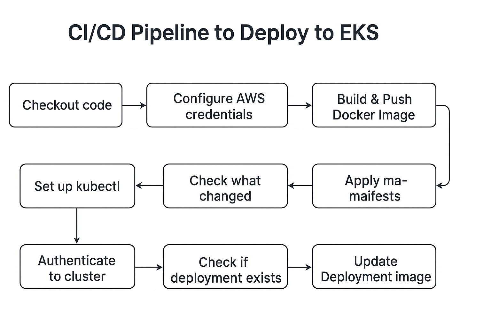

# Flask To-Do List App

A Flask web application with MySQL backend for devops end to end implementation.
## Prerequisites
- Python 3.8+
- MySQL Server 

## Setup without docker
First clone the repository:
```bash
git clone https://github.com/ChepkemoiPeris/python-todo-app-devops-demo.git
cd python-todo-app-devops-demo/app
```
    
1. Create and activate a virtual environment:
   ```bash
   python3 -m venv venv
   source venv/bin/activate
    
2. Install dependencies:
    ```bash
    pip install -r requirements.txt

3. Create mysql database and then rename .env.example to .env and update the values to match your credentials      
    MYSQL_HOST=localhost
    MYSQL_PORT=3306
    MYSQL_USER=user
    MYSQL_PASSWORD=1234
    MYSQL_DATABASE=todo_db 


4. Run the app:
    ```bash
    python app.py

## Run with docker
### Prerequisites
- docker
1. Build the Docker image:
 It’s recommended to tag your image with the format: `<dockerhub-username>/<app-name>:<version>`
 For example: 
    ```bash
    docker build -t username/todoapp:v1 .
Replace username with your own Docker Hub username if you plan to push the image to Docker Hub.
If you’re only running locally, you can simply use a name like todoapp:v1.

2. Create a Docker network
    ```bash
    docker network create todoappnet

3. Start a MySQL container on the todoappnet network
    ```bash
    docker run -d \
    --name todo-mysql \
    --network todoappnet \
    -e MYSQL_ROOT_PASSWORD=rootpass \
    -e MYSQL_DATABASE=todo_db \
    -e MYSQL_USER=todo_user \
    -e MYSQL_PASSWORD=todo_pass \
    -p 3306:3306 \
    mysql:8
    ```

4. Update .env for Docker to match mysql container values:
    ```bash
    MYSQL_HOST=todo-mysql
    MYSQL_USER=todo_user
    MYSQL_PASSWORD=todo_pass
    MYSQL_DATABASE=todo_db
    ```

5. Run the flask-todo container on the same network as mysql container:
Make sure you have a .env file in the root of the project before running this step.
    ```bash
    docker run -d \
    --name flask-todo \
    --network todoappnet \
    -p 5000:5000 \
    --env-file .env \
    username/todoapp:v1
    ```
6. Access the application:
    Open your browser at http://localhost:5000

### Notes
- The MySQL container will automatically create the database and user on first run.

- Data will be lost if the MySQL container is removed. To persist data,you can add a volume

## Run with docker compose
1. From the project’s root directory run:
    ```bash
    docker compose up --build
    ```
    The --build flag ensures the image is rebuilt if you made code or dependency changes.

2. To stop and remove all containers run:
    ```bash
    docker compose down
    ```

    This will remove the containers but keep your database volume (mysqldata).
    To also remove volumes/data, use:

    ```bash
    docker compose down -v  
    ```    
3. Access the application:
    Open your browser at http://localhost:5000

4. Check logs (optional)
    ```bash
    docker compose logs -f

5. Run in the background (optional)
  Start services in detached mode:
  ```bash
  docker compose up -d
  ```
## Terraform and Kubernetes
This project uses Terraform to provision cloud infrastructure (VPC,EKS,RDS) and Kubernetes manifests to deploy the application. Please refer to the following folders for detailed instructions:

- `/terraform` → Contains Terraform modules and instructions to create VPC, EKS, RDS, and IAM   resources. See /terraform/README.md for setup details.

- `/k8s` → Contains Kubernetes manifests (Deployment, Service, Ingress, ConfigMap, Secrets) to deploy the app on EKS. See /k8s/README.md for setup details.

## CI/CD Pipeline (GitHub Actions)
We have a GitHub Actions workflow to automate builds, image pushes to Docker Hub, and deployments to EKS.




**Workflow Overview**
 
| Stage                             | Description                                                                                                                                             |
| --------------------------------- | ------------------------------------------------------------------------------------------------------------------------------------------------------- |
| **1. Checkout code**              | Pulls the latest version of the repository from GitHub so the workflow can access all files.                                                            |
| **2. Configure AWS credentials**  | Authenticates with AWS using secrets stored in GitHub (Access Key and Secret Key). This allows subsequent steps to interact with EKS.                   |
| **3. Set up kubectl**             | Installs the Kubernetes CLI (`kubectl`) so GitHub Actions can manage the EKS cluster.                                                                   |
| **4. Authenticate to cluster**    | Connects `kubectl` to the target EKS cluster using the AWS CLI and cluster name.                                                                        |
| **5. Check what changed**         | Detects if changes occurred in the `app/` or `k8s/` directories. This ensures only relevant stages are executed. |
| **6. Build & Push Docker Image**  | If the `app/` folder changed, a new Docker image of the Flask app is built and pushed to Docker Hub with the current commit SHA as its tag.             |
| **7. Check if deployment exists** | Verifies if the Kubernetes deployment (`todo-app-deployment`) already exists in the cluster.                                                            |
| **8. Apply Kubernetes manifests** | If the `k8s/` folder changed or the deployment doesn’t exist, all manifest files are applied to create/update Kubernetes resources.                     |
| **9. Update Deployment image**    | If only `app/` changed (not manifests), the pipeline updates the running deployment’s container image to the new version.                               |


**Important Notes**
For GitHub Actions, all secrets are stored in the repository settings, under Settings → Secrets → Actions.  

    To add secrets:

    1. Go to your repository on GitHub.

    2. Click on Settings → Secrets → Actions.

    3. Click New repository secret.

    4. Enter the name and value for each secret.

    5. Click Add secret.

    - Once these are set, the GitHub Actions workflow will automatically use them during builds and deployments.

    For this CI/CD workflow we require the following secrets to be configured in your GitHub repository:

    | Secret Name             | Purpose                                                                            |
    |-------------------------|----------------------------------------------------------------------------------|
    | `DOCKER_USER`           | Your Docker Hub username                                                           |
    | `DOCKER_PASS`           | Your Docker Hub password or access token                                           |
    | `AWS_ACCESS_KEY_ID`     | AWS IAM user access key with permissions to manage EKS, RDS, and related resources |
    | `AWS_SECRET_ACCESS_KEY` | AWS IAM user secret key                                                            |
    | `AWS_REGION`            | AWS region where your EKS cluster is deployed                                      |
    | `EKS_CLUSTER_NAME`           | Name of your EKS cluster                                                           |

### Accessing the Application on EKS
Once the CI/CD pipeline has completed successfully, you can retrieve the public URL of the application using the Ingress resource created by the AWS Load Balancer Controller.
1. Connect to your EKS cluster:
    ```bash
    aws eks --region <AWS_REGION> update-kubeconfig --name <EKS_CLUSTER_NAME>
    ```
2. Get the Ingress details:
    ```bash
    kubectl get ingress
    ```
    Copy the value under the ADDRESS column, Open the URL in your browser to access the To-Do app running on EKS

## Challenges faced on cicd setup:

Initially, the GitHub Actions workflow triggered redundantly on every commit. Fixed this by adding conditional checks using GitHub path filters so it only runs when relevant folders (app/, k8s/, terraform/) change.